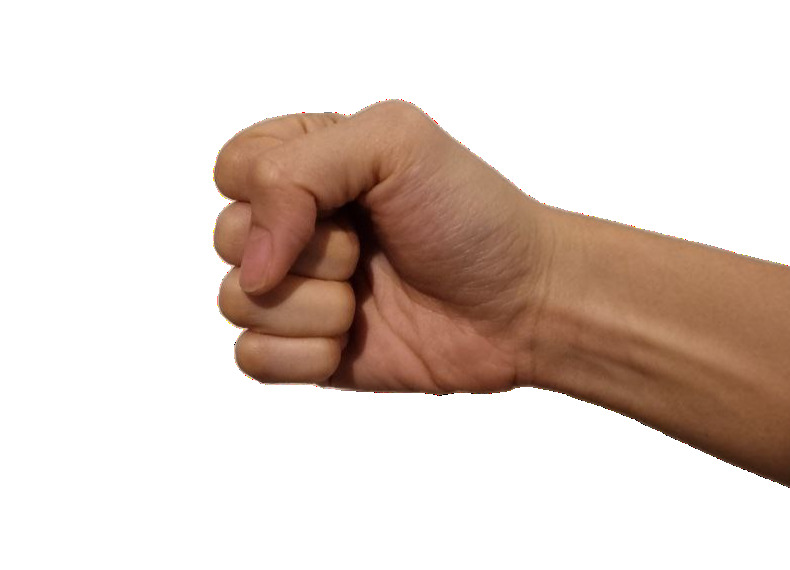
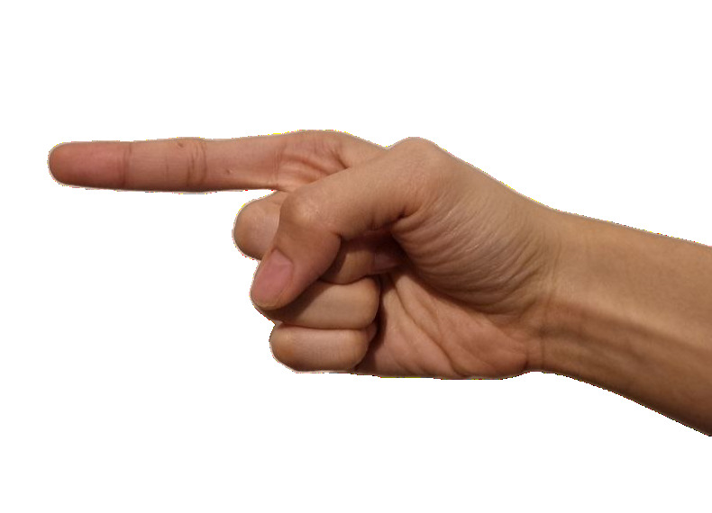
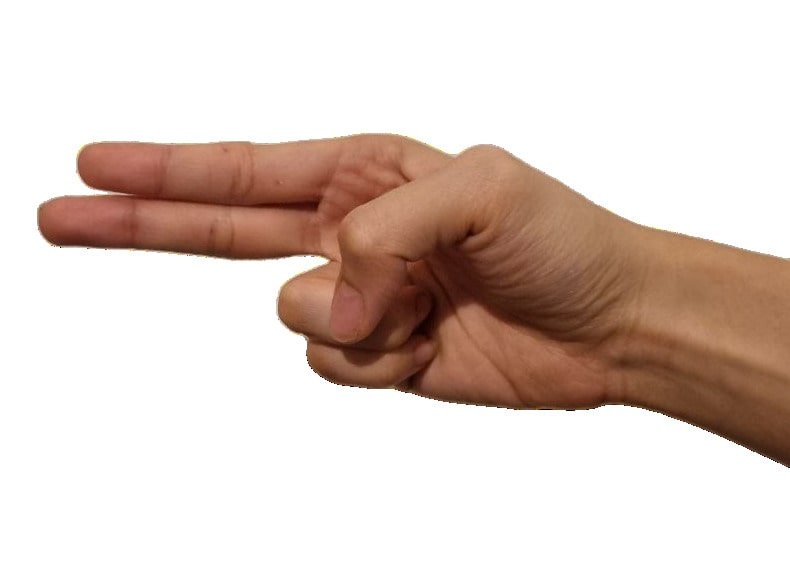
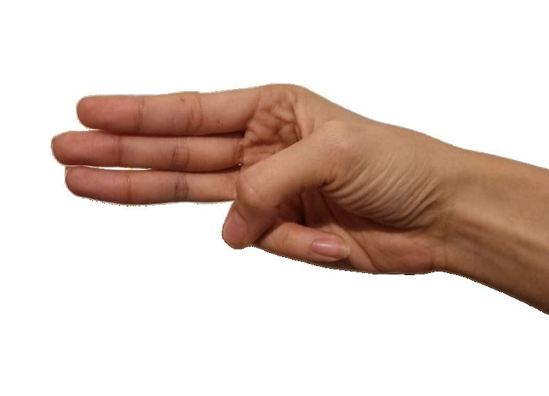
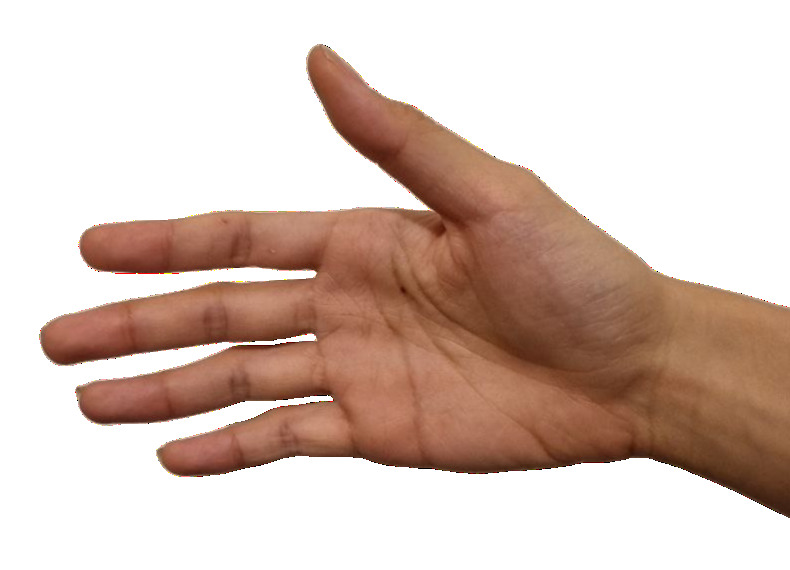
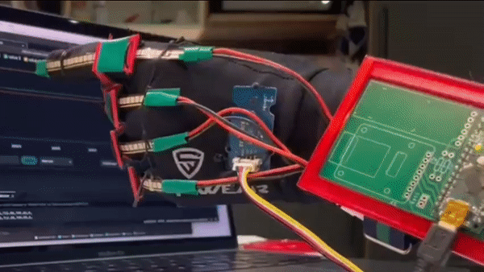

# Gesture-Controlled Drumkit
This project was completed as part of the MSc Applied Machine Learning programme at Imperial College London's Department of Electrical Engineering.

This project develops a data glove with flex sensors and an inertial measurement unit (IMU) to produce different MIDI sounds with different gestures. Machine learning is used to classify the different gestures into different parts of the drum (kick, snare, hi-hat), allowing the user to use the data gloves to "play drums".

## Functions
The model classifies five gestures into five main parts of a standard acoustic drum kit: the kick, hi-hat, snare, tom and crash.
| Sound | Kick | Hihat | Snare | Tom | Crash |
|:--:|:--:|:--:|:--:|:--:|:--:|
| Gesture |  |  |  |  |  |
|| *Fist* | *1 finger* | *2 fingers* | *3 fingers* | *Open palm* |

The user chooses which drum sound to produce through the gesture, and when to produce the sound by performing a quick downward motion with their hand.
<p align="center">
   
   <br>
   <sup>A quick, downward movement to produce a beat</sup>
</p>

Using the data gloves, the user can "play drums" in realtime, using manually downloaded drum sounds or MIDI sounds produced through a DAW.
<p align="center">
   <a href="https://user-images.githubusercontent.com/76771375/230881525-39b6372d-07eb-436d-a541-51e37daa3ca2.mp4"></a>
   <br>
   <sup>Using one data glove to play drums using Logic Pro<br>(click for sound)</sup>
</p>

## Data Collection
1. Upload **arduino/code>code.ino** to your Nano.
2. In **collect_data.py**, define your paths. For Windows, ```SERIAL_PATH``` would be like "COM10". For Unix systems, ```SERIAL_PATH``` should be something like "/dev/ttyUSB0". ```FIGURES_PATH``` is optional (directory doesn't have to exist).
3. Run **collect_data.py**. When prompted for the gesture, type in the gesture for that trial in the format ```<first_gesture_num><second_gesture_num>``` (e.g. 13). Gestures are: 
   - (0) Kick - fist
   - (1) Hihat - 1 finger
   - (2) Snare - 2 fingers
   - (3) Tom - 3 fingers
   - (4) Crash - open palm
4. Once ```Reading...``` is printed, start doing your gestures. Collect 100 gestures.
5. Once 100 gestures have been performed, press Ctrl-C to stop data collection. When prompted for your CSV filename, input your desired filename or just press Enter to set it as the gesture you previously inputted.

## Prediction
1. In **predict.py**, set your `MODEL_PATH` and corresponding `SOUNDS` keys (if you're planning to output keypresses to a DAW). Also, set the `SERIAL_PATH` if your USB device path does not fall under `/dev/XXX`.
2. Install dependecy packages: **pyserial**, **pyglet** if you're planning to play the provided samples (`--sound p`), and **pynput** if you're planning to use a DAW (`--sound k`).
3. Run the script with `python3 predict.py [--dev <usb_device_path>] [--hand <l/r>] [--sound <k/p>]`.
4. The script will wait awhile to sync with the logging. Wait for the statement `Ready.` to be printed.
5. Start doing your gestures.
6. If you're running with `--sound p`, the print statements might stop working after awhile. Not sure why this happens, usually I just restart the script.

## Files
- **collect_data.py**: Python script for collecting data
- **create_dataset.ipynb**: Jupyter notebook for creating combined dataset from individual CSVs of trials for each gesture transition
- **predict.py**: Python script for realtime gesture prediction
